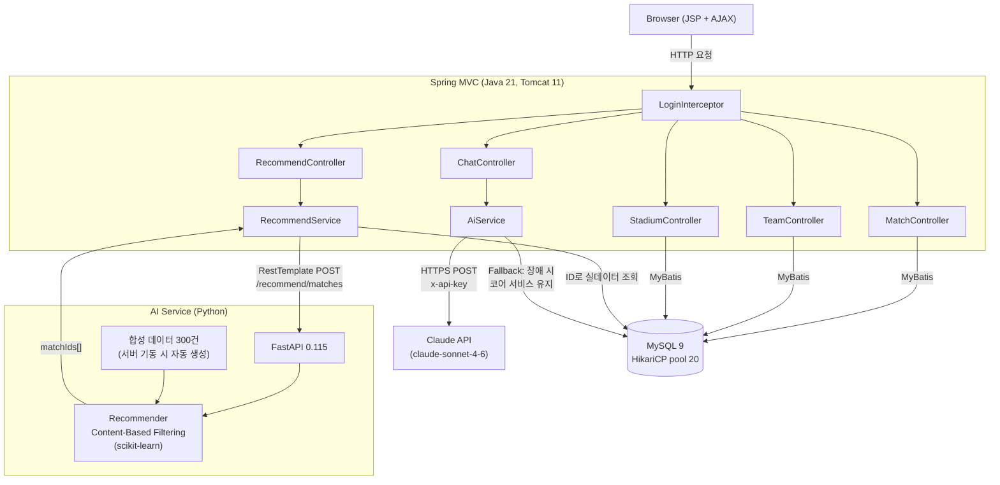

# letsfutsal ⚽

> 풋살 팀 매칭 & 경기장 예약 플랫폼  
> 4인 팀 프로젝트 (2025.12 ~ 2026.01) + AI 기능 단독 추가 개발 (2026.04)

---

## Architecture



---

## 기술 스택

| 구분 | 기술 |
|---|---|
| Backend | Java 21, Spring MVC 7.0.1, MyBatis 3.5.19, HikariCP 7.0.2 |
| Database | MySQL 9 |
| Frontend | JSP 4.0, JSTL 3.0, JavaScript (AJAX), Bootstrap 5 |
| AI / ML | Python 3, FastAPI 0.115, scikit-learn 1.5.2, pandas 2.2.3 |
| LLM | Claude API (claude-sonnet-4-6) |
| Build | Maven, Spotless (Eclipse formatter), Apache Tomcat 11 |

---

## 주요 기능

### 팀 프로젝트 담당 (팀·경기장 도메인)
- 팀 생성 / 목록 / 프로필 / 가입
- 경기장 조회 및 매치 생성 시 경기장 연결

### 전체 도메인
- **회원**: 회원가입 / 로그인 / 마이페이지 / 프로필 / 이메일 중복 확인
- **매치**: 목록(7개 조건 필터링) / 상세 / 개인·팀·대여 3가지 타입
- **게시판**: 자유게시판 게시글 / 댓글
- **랭킹**: 성별·등급·포지션별 유저 랭킹

### AI 기능 (단독 추가 개발)

#### 매치 추천 엔진
1. Spring → FastAPI에 유저 프로필(포지션/성별/등급) POST
2. FastAPI: 합성 데이터 300건 대상으로 Content-Based Filtering 수행
   - 등급 범위 필터 → 성별 호환 필터 → 등급 중간값 거리 역수 스코어링
3. 매치 ID 5개 반환 → Spring에서 DB 실데이터 조회 후 응답

#### AI 풋살 챗봇
- 로그인 유저 컨텍스트(닉네임/포지션/등급/최근 매치)를 시스템 프롬프트에 동적 주입
- 일 30회 Rate Limiting (세션 기반, 날짜 갱신 시 자동 초기화)
- 입력 500자 제한, XSS 방지 (`HtmlUtils.htmlEscape`)

---

## Troubleshooting

### JSP EL과 JavaScript 충돌
`<script>` 블록 내 `${m.matchId}` JSP EL이 서버에서 빈 문자열로 파싱되어 AI 추천 카드 미렌더링 → JS 객체 프로퍼티 직접 참조로 변경해 해결

### FastAPI 장애 격리 (Fallback)
FastAPI 서버 다운 시 `RestTemplate` 예외가 Spring까지 전파되는 구조 → `try-catch`로 예외 캐치 후 DB 최신 매치 목록으로 자동 Fallback. AI 장애가 코어 서비스를 중단시키지 않는 구조.

### Cold-start 문제
초기 DB에 매치 데이터 없어 추천 불가 → FastAPI lifespan에서 서버 기동 시 실제 Enum 값 기반 합성 데이터 300건 자동 생성. 실 데이터 축적 시 점진적 교체 구조로 설계.

### Tomcat 재배포 미반영
신규 WAR 빌드 후 기존 확장 디렉토리(`letsfutsal/`)가 남아있어 Tomcat이 신규 WAR 무시 → 확장 디렉토리 삭제 + 프로세스 강제 종료 후 클린 재배포.

---

## 실행 방법

### 1. DB 초기화

```sql
-- MySQL에서 실행
source sql/letsfutsal_init.sql
source sql/letsfutsal_sample.sql
```

### 2. Spring 앱 빌드 & 배포

```bash
mvn package -DskipTests
# target/letsfutsal.war → Tomcat webapps/에 복사 후 Tomcat 시작
```

### 3. AI 서비스 실행 (추천 엔진)

```bash
cd ai-service
pip install -r requirements.txt
uvicorn main:app --reload --port 8000
```

### 4. 환경변수 설정 (챗봇)

```bash
# Tomcat 시작 전 설정
export CLAUDE_API_KEY=sk-ant-...
# AI 서비스 URL 커스텀 시 (기본값: http://localhost:8000)
export AI_SERVICE_URL=http://localhost:8000
```

---

## 프로젝트 구조

```
letsfutsal/
├── src/main/java/.../
│   ├── ai/                  # AI 기능 (단독 추가)
│   │   ├── AiService.java        # Claude API 연동
│   │   ├── ChatController.java   # POST /ai/chat
│   │   ├── RecommendService.java # FastAPI 호출 + Fallback
│   │   └── RecommendController.java # GET /ai/recommend/matches
│   ├── team/                # 팀 도메인 (팀 프로젝트 담당)
│   ├── stadium/             # 경기장 도메인 (팀 프로젝트 담당)
│   ├── match/ user/ board/ rank/
│   └── config/              # RootConfig, WebConfig, AppInitializer
├── ai-service/              # Python FastAPI 추천 서버
│   ├── main.py
│   ├── recommender.py       # Content-Based Filtering
│   ├── data_generator.py    # 합성 데이터 생성
│   └── requirements.txt
└── src/main/webapp/WEB-INF/views/
    └── common/header.jsp    # 플로팅 챗봇 UI
```
